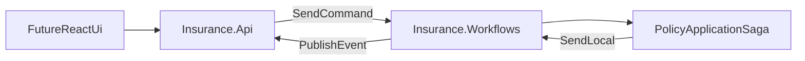

# NServiceBus Insurance Test Project

This repository is a minimal, local-first learning project for getting hands-on with NServiceBus in a realistic insurance workflow.

It uses:

- Two endpoints: `Insurance.Api` and `Insurance.Workflows`
- Clean Architecture-inspired layering
- NServiceBus Learning Transport + Learning Persistence (no broker or DB required)
- A policy-application saga that drives underwriting and policy issuance

## Architecture



## Project Structure

```text
nservicebus-test.sln
src/
  Insurance.Domain/          Domain model and invariants
  Insurance.Application/     Ports and application models
  Insurance.Messages/        Commands and events
  Insurance.Infrastructure/  In-memory repositories, read stores, underwriting rules
  Insurance.Api/             ASP.NET Core API + read-model event handlers
  Insurance.Workflows/       Worker endpoint with handlers + saga
tests/
  Insurance.Workflows.Tests/ Saga and underwriting tests
```

## Insurance Workflow

1. API receives `POST /api/policies/applications`.
2. API sends `SubmitPolicyApplication` command to `Insurance.Workflows`.
3. Worker stores application and publishes `PolicyApplicationSubmitted`.
4. Saga starts, sends `PerformUnderwriting` locally.
5. Underwriting publishes `UnderwritingCompleted`.
6. Saga either:
   - sends `IssuePolicy` if approved, then marks complete when `PolicyIssued` arrives, or
   - publishes `PolicyApplicationRejected` and completes.
7. API subscribes to events and updates in-memory read models exposed via GET endpoints.

## API Endpoints

- `POST /api/policies/applications`
- `GET /api/policies/applications/{id}`
- `POST /api/policies/applications/{id}/cancel`
- `GET /api/policies/{policyId}`

## Running Locally

Prerequisite:

- .NET 8 SDK installed

Commands:

```bash
dotnet restore
dotnet build
dotnet test
```

Run endpoints in separate terminals:

```bash
dotnet run --project src/Insurance.Workflows
```

```bash
dotnet run --project src/Insurance.Api
```

Open Swagger from the API launch URL, then submit applications and query status.

## Sample Request Flow

Create an application:

```bash
curl -X POST "https://localhost:5001/api/policies/applications" \
  -H "Content-Type: application/json" \
  -d '{
    "customerId":"9c88d266-7be7-4edc-8fb2-eef77f77999b",
    "coverageType":"Auto",
    "requestedAmount":150000,
    "currency":"USD"
  }'
```

The response returns an `applicationId` you can use with:

```bash
curl "https://localhost:5001/api/policies/applications/{applicationId}"
```